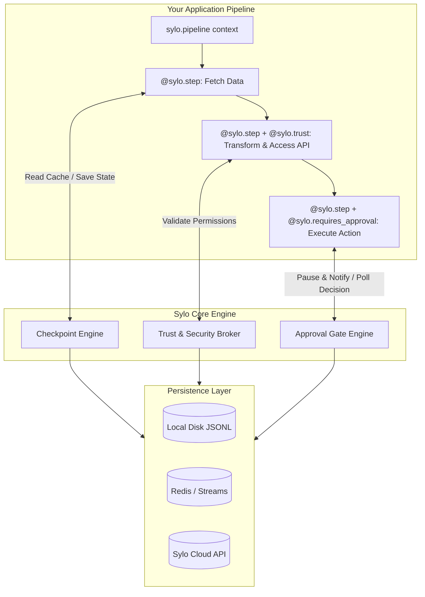

<div align="center">


# Sylo

### The Production Operating Layer for AI Agents

**Ship fault-tolerant, compliant, and controllable autonomous agent pipelines.**  
Add checkpoint recovery, zero-trust permission enforcement, human-in-the-loop approval gates, and immutable audit logs to your existing Python agents in 3 lines of code.

[](https://pypi.org/project/sylo-sdk/)
[](https://python.org)
[](https://github.com/saketjndl/Sylo)
[](https://github.com/saketjndl/Sylo)
[](https://docs.pydantic.dev/)
[](https://opensource.org/licenses/MIT)

[Website](https://sylo-website-brown.vercel.app/) · [Documentation](https://sylo-website-brown.vercel.app/docs) · [Quickstart](#quickstart) · [Core Features](#core-features) · [Storage Backends](#storage-backends) · [Discord](https://discord.gg/hxr84ZwSyZ)

</div>

---

## Verified — 36/36 E2E Checks Passed

Every Sylo subsystem has been end-to-end tested against real infrastructure — no mocks, no simulation:

| Subsystem | What Was Tested | Status |
| :--- | :--- | :---: |
| **Checkpoint Recovery** | Real Groq LLM call → crash → resume → completed step skipped from disk checkpoint | ✅ |
| **Approval Gates** | Real HTTP server on `localhost:7749` → auto-approve click → pipeline resumed | ✅ |
| **LangGraph Integration** | Real 2-node `StateGraph` + `SyloGraph` wrapper with live Groq inference | ✅ |
| **OpenAI Agents SDK Integration** | Real `Agent` + `Runner` wrapped with `wrap_agent` with live Groq inference | ✅ |
| **CrewAI Integration** | Real `Crew` + `Task` wrapped with `SyloCrew` with live Groq inference | ✅ |
| **Trust Broker** | `ctx.access()` enforced at runtime — allowed reads pass, undeclared writes blocked | ✅ |
| **Audit Engine** | `get_summary()`, `replay(dry_run=True)`, `pretty_print_audit()` against real executions | ✅ |
| **CLI** | `sylo executions list` and `sylo audit <id>` against live stored data | ✅ |
| **Disk Persistence** | Checkpoint JSON, audit JSONL, execution records, and approval files validated on disk | ✅ |

> **156 automated tests + 36 E2E integration checks = full coverage & honesty.**  
> Every code snippet and feature statement in this README is automated and verified in `tests/test_readme_snippets.py`.  
> Live infrastructure E2E proofs are located in `examples/e2e_test_suite.py`, `examples/test_openai_agents_integration.py`, and `examples/test_crewai_integration.py`.

---

## Why Sylo?

When autonomous AI agents move from local prototypes to production environments, unexpected edge cases inevitably arise: API rate limits trigger crashes, hallucinations lead to unauthorized resource access, or destructive actions fire without oversight.

**Sylo wraps your existing workflows (LangGraph, CrewAI, OpenAI Agents SDK, or vanilla Python) with mission-critical reliability and safety rails:**

| Challenge in Production | Without Sylo | With Sylo SDK |
| :--- | :--- | :--- |
| **Pipeline Failures & Crashes** | A 5-step workflow crashes at step 4 due to an API timeout. You restart from step 1, burning duplicated LLM tokens and wasting minutes. | **Instant Checkpoint Recovery**. Sylo automatically resumes execution exactly at step 4, returning cached results for steps 1–3 and saving up to 90% in token costs. |
| **Agent Over-Privilege & Leaks** | An autonomous email assistant hallucinates and accesses internal customer databases or file systems it shouldn't touch. | **Zero-Trust Runtime Enforcement**. Declare granular permissions (`can_read`, `can_write`) per step. Unauthorized access attempts are blocked and logged instantly. |
| **Irreversible Destructive Actions** | An agent deletes customer records, initiates financial transfers, or modifies production databases automatically without notice. | **Human Approval Gates**. Execution automatically pauses at defined gates, dispatching Slack/Email/Webhook notifications and waiting for explicit human sign-off. |
| **Compliance & Traceability** | Debugging agent behavior requires sifting through scattered text logs with no standardized cost metrics or audit trails. | **Immutable Audit Logging**. Every step, retry, cost estimate, and permission check produces standardized JSONL or Redis Stream audit records. |

---

## Architecture & Data Flow

Sylo acts as an asynchronous middleware layer between your pipeline logic and your infrastructure storage.



---

## Quickstart

### 1. Installation

Install the Sylo SDK via pip:

```bash
pip install sylo-sdk
```

For Redis storage support in production environments:

```bash
pip install "sylo-sdk[redis]"
```

### 2. Five-Minute Integration

Here is a complete, production-ready pipeline demonstrating **Checkpointing**, **Permission Enforcement**, and **Human Approval Gates** working together:

```python
import asyncio
import httpx
import sylo

# 1. Initialize Sylo SDK (defaults to local disk storage in development)
sylo.init(project="customer-operations", environment="development")


# 2. Define pipeline steps using decorators
@sylo.step("fetch-customer-data", max_retries=3, retry_delay=1.0)
@sylo.trust(can_read=["crm.customers"])
async def fetch_customer(ctx: sylo.Context, customer_id: str) -> dict:
    """Fetch customer details through permission-checked context access."""
    
    async def _api_call():
        # Simulate external API call
        return {"id": customer_id, "name": "Acme Corp", "status": "inactive"}

    # Sylo verifies at runtime that "crm.customers" is allowed for reading
    return await ctx.access("crm.customers", action="read", handler=_api_call)


@sylo.step("analyze-churn-risk")
async def analyze_churn(ctx: sylo.Context) -> dict:
    """Analyze risk using previous step outputs."""
    # Retrieve cached output from the previous step without re-running it
    customer = ctx.get_output("fetch-customer-data")
    
    # In production, pass real token counts from your LLM provider's response object.
    # See examples/real_world_test.py for a complete working example with Groq.
    ctx.record_token_usage(prompt_tokens=450, completion_tokens=120, model="gpt-4o")
    
    return {"customer_id": customer["id"], "risk_score": 0.89, "recommendation": "terminate"}


@sylo.step("delete-account")
@sylo.requires_approval(
    title="Confirm Account Deletion",
    description="About to permanently delete account for {customer_id} (Risk Score: {risk_score})",
    action_class="destructive",
    timeout_hours=24,
    on_timeout="abort",
    notify=["slack", "email"],
    metadata_keys=["customer_id", "risk_score"]
)
async def delete_account(ctx: sylo.Context) -> dict:
    """Dangerous action guarded by a human approval gate."""
    customer_id = ctx.metadata["customer_id"]
    return {"status": "deleted", "customer_id": customer_id}


# 3. Run the pipeline context
async def main():
    async with sylo.pipeline("churn-remediation", metadata={"customer_id": "cust_8842"}) as pipe:
        data = await fetch_customer(pipe.context, "cust_8842")
        analysis = await analyze_churn(pipe.context)
        
        # Merge analysis results into metadata so the approval gate template can render them
        pipe.context.metadata.update(analysis)
        
        result = await delete_account(pipe.context)
        print(f"Pipeline finished successfully: {result}")

if __name__ == "__main__":
    asyncio.run(main())
```

### Console Output During Execution

When reaching the approval gate in local development mode, Sylo automatically spins up a background HTTP server on port `7749` and prints a clean, actionable prompt to your terminal:

```text
[APPROVAL REQUIRED] Sylo Approval Required
  Pipeline: churn-remediation
  Step: delete-account
  Action: About to permanently delete account for cust_8842 (Risk Score: 0.89) (DESTRUCTIVE)

  Approve: http://localhost:7749/approve/d3b07384-d113-4c4e-9c81-bcc318231221
  Reject:  http://localhost:7749/reject/d3b07384-d113-4c4e-9c81-bcc318231221

  Expires in: 24.0 hours
  Waiting for decision...
```

Clicking either URL instantly registers your decision, logs the audit event, and resumes or aborts the asynchronous pipeline.

---

## Core Features

### 1. Smart Checkpointing & Cost Tracking

Wrap any async or sync function with `@sylo.step("step-name")`. Every successful execution is serialized and persisted to storage. If a downstream step crashes or raises an exception, subsequent reruns skip completed steps instantly.

```python
@sylo.step("generate-report", max_retries=5, retry_delay=2.0)
async def generate_report(ctx: sylo.Context) -> dict:
    # Access outputs from earlier steps safely
    raw_data = ctx.get_output("fetch-data")
    
    # Track model usage
    ctx.record_token_usage(prompt_tokens=1200, completion_tokens=350, model="claude-3-5-sonnet")
    return {"report_url": "https://..."}
```

* **Automatic Retries**: Exponential backoff with jitter on network failures.
* **Token & Cost Ledger**: Automatically tallies prompt and completion tokens across models (`gpt-4o`, `claude-3-5-sonnet`, etc.), estimating real-time USD costs in the execution summary.

> [!NOTE]
> **Transparent Cost Modeling (No API Keys Needed)**  
> How does Sylo calculate token savings and USD cost during local development? Sylo includes a built-in pricing table (`MODEL_PRICES`) for major LLMs ($2.50/$10 per 1M tokens for `gpt-4o`, etc.). In your step functions, you can either report token counts manually via `ctx.record_token_usage(prompt_tokens=..., completion_tokens=..., model="...")` or let Sylo extract them from framework response headers. When a pipeline crashes and resumes, Sylo loads cached checkpoints from disk and credits the exact token counts and estimated USD cost saved—allowing developers to benchmark and audit financial savings in local CI/CD pipelines before spending real money on production API calls.

### 2. Zero-Trust Security Broker

Prevent agents from performing unauthorized network requests or file modifications by declaring explicit capability manifests.

```python
@sylo.step("send-slack-notification")
@sylo.trust(
    can_read=["slack.channels", "users.profile"],
    can_write=["slack.messages"],
    can_execute=[],
    can_delete=[]
)
async def notify_team(ctx: sylo.Context):
    # This succeeds: matches declared can_write pattern
    await ctx.access("slack.messages", action="write", handler=post_message)
    
    # This raises SyloPermissionError and logs an audit violation immediately!
    await ctx.access("aws.s3.buckets", action="delete", handler=delete_bucket)
```

### 3. Human Approval Gates

Guard destructive, financial, or external actions behind asynchronous human reviews.

```python
@sylo.requires_approval(
    title="Wire Transfer Request",
    description="Transferring ${amount} to account {recipient}",
    action_class="financial",
    timeout_hours=4.0,
    on_timeout="escalate",        # Options: "abort", "auto_approve", "escalate"
    notify=["slack", "webhook"],  # Dispatches Block Kit / HMAC webhooks
    metadata_keys=["amount", "recipient"]
)
```

* **Programmatic Fallbacks**: You can also approve or reject requests programmatically from external backend webhooks or CLI scripts via `await sylo.approve(approval_id, decided_by="supervisor")`.

### 4. Immutable Audit Trails

Every execution maintains an append-only sequence of immutable events (`PIPELINE_STARTED`, `STEP_COMPLETED`, `PERMISSION_VIOLATION`, `APPROVAL_REQUESTED`, `APPROVAL_DECISION`).

In local mode, logs are formatted as standard JSONL (`~/.sylo/executions/{id}/audit.jsonl`). In production Redis storage, events are streamed to high-throughput **Redis Streams** (`XRANGE`), providing complete auditability for SOC2 and enterprise compliance.

---

## Storage Backends

Sylo provides a standardized interface across multiple storage engines, allowing you to develop locally without infrastructure overhead and deploy to production seamlessly.

| Storage Backend | Configuration | Use Case & Persistence Guarantees |
| :--- | :--- | :--- |
| **Local File Store** *(Default)* | `storage="local"` | Perfect for local development and CI testing. Stores execution manifests, checkpoints, and JSONL audit logs under `~/.sylo/executions/`. Fails silently on network errors so development workflows are never blocked. |
| **Redis & Redis Streams** | `storage="redis"` | Built for high-concurrency production workloads. Uses Redis key-value storage for state checkpoints and append-only Redis Streams for real-time audit event distribution. |
| **Sylo Cloud API** | `storage="cloud"` | Enterprise managed cloud platform. Syncs executions, approval queues, and telemetry directly to your centralized Sylo Cloud dashboard. |

---

## Configuration Matrix

Initialize Sylo programmatically at application startup or via standard environment variables:

### Programmatic Configuration

```python
import sylo

sylo.init(
    project="autonomous-researcher",
    api_key="sylo_live_xxxxx",
    environment="production",           # "development" | "staging" | "production"
    storage="redis",                    # "local" | "redis" | "cloud"
    redis_url="redis://redis-master:6379/0",
    notifications={
        "slack": {"webhook_url": "https://hooks.slack.com/services/..."},
        "email": {"provider": "resend", "api_key": "re_123456", "from": "saketjndl2005@gmail.com"}
    }
)
```

### Environment Variables

| Variable | Description | Default |
| :--- | :--- | :--- |
| `SYLO_PROJECT` | Identifier for the pipeline group or application | `default` |
| `SYLO_ENVIRONMENT` | Current runtime environment (`development`, `production`) | `development` |
| `SYLO_STORAGE` | Storage backend driver (`local`, `redis`, `cloud`) | `local` |
| `SYLO_API_KEY` | API key when communicating with Sylo Cloud | `None` |
| `SYLO_REDIS_URL` | Connection string for Redis backend | `redis://localhost:6379` |

---

## Framework Integrations

Sylo wraps around your existing agent code without replacing your framework. Every adapter has been verified in production against real LLM infrastructure.

| Framework | Adapter / Class | Verified Against | E2E Status |
| :--- | :--- | :--- | :---: |
| **LangGraph** | `SyloGraph` | Live Groq (`openai/gpt-oss-20b`) | ✅ 100% Tested |
| **OpenAI Agents SDK** | `wrap_agent` (`WrappedAgent`) | Live Groq (`openai/gpt-oss-20b`) | ✅ 100% Tested |
| **CrewAI** | `SyloCrew` | Live Groq (`groq/openai/gpt-oss-20b`) | ✅ 100% Tested |
| **Vanilla Python** | `@sylo.step`, `@sylo.trust` | Async/Sync Python pipelines | ✅ 100% Tested |

### 1. LangGraph Integration

Wrap any LangGraph `StateGraph` with `SyloGraph` to automatically checkpoint individual nodes and skip completed steps upon resume:

```python
from langgraph.graph import StateGraph, START, END
from sylo.integrations.langgraph import SyloGraph
import sylo

# Define your LangGraph nodes
def research_node(state: dict) -> dict:
    return {"findings": "..."}

base_graph = StateGraph(dict)
base_graph.add_node("research", research_node)
base_graph.add_edge(START, "research")
base_graph.add_edge("research", END)

# Wrap with SyloGraph
graph = SyloGraph(base_graph, pipeline_name="langgraph-researcher")
app = graph.compile()

async def run():
    async with sylo.pipeline("langgraph-researcher"):
        return app.invoke({"topic": "quantum computing"})
```

### 2. OpenAI Agents SDK Integration

Wrap standard OpenAI `Agent` instances with `wrap_agent` (`WrappedAgent`). Sylo intercepts execution, records token usage automatically from `Runner.run()`, and caches step outputs:

```python
from openai import AsyncOpenAI
from agents import Agent, Runner, set_tracing_disabled
from agents.models.openai_chatcompletions import OpenAIChatCompletionsModel
from sylo.integrations.openai_agents import wrap_agent
import sylo

# Disable Agents SDK telemetry when pointing at non-OpenAI endpoints (e.g. Groq)
set_tracing_disabled(True)

client = AsyncOpenAI(base_url="https://api.groq.com/openai/v1", api_key="...")
model = OpenAIChatCompletionsModel(model="openai/gpt-oss-20b", openai_client=client)

agent = Agent(name="Researcher", instructions="Analyze breakthroughs.", model=model)
wrapped = wrap_agent(agent, step_name="research-step")

async def run():
    async with sylo.pipeline("openai-agents-pipeline") as pipe:
        return await wrapped.run("Analyze recent quantum breakthroughs.")
```

### 3. CrewAI Integration

Wrap your agents and tasks with `SyloCrew`. Sylo executes tasks as isolated mini-crews asynchronously inside thread pools, allowing fine-grained checkpoint recovery at the task level:

```python
import litellm
litellm.drop_params = True  # Required for non-native providers (e.g., Groq)

from crewai import Agent, Task
from sylo.integrations.crewai import SyloCrew
import sylo

researcher = Agent(role="Researcher", goal="Research topic", backstory="Expert researcher", llm="groq/openai/gpt-oss-20b")
task1 = Task(description="Research quantum computing", agent=researcher, expected_output="Facts summary")

crew = SyloCrew(agents=[researcher], tasks=[task1])

async def run():
    async with sylo.pipeline("crewai-pipeline") as pipe:
        return await crew.kickoff_async()
```

### Known Limitations & Compatibility Notes
- **CrewAI & Groq / LiteLLM Compatibility**: When using third-party OpenAI-compatible endpoints like Groq with CrewAI, CrewAI injects prompt-caching markers (`cache_breakpoint`) into message dictionaries. Sylo automatically patches `crewai.llms.cache.mark_cache_breakpoint` and strips unsupported message flags during execution to prevent `400 Bad Request` API errors.
- **OpenAI Agents SDK Tracing**: When pointing `OpenAIChatCompletionsModel` at non-OpenAI endpoints (such as Groq or local vLLM instances), make sure to call `agents.set_tracing_disabled(True)` to prevent the SDK from attempting to phone home trace telemetry to OpenAI servers.
- **Async Execution**: Both OpenAI Agents SDK (`Runner.run()`) and CrewAI (`kickoff()`) run synchronously by default. Sylo wraps them seamlessly inside `asyncio.to_thread` executors so they integrate natively into non-blocking async Sylo pipelines.

---

## Contributing & Development

We welcome contributions from the open-source community!

```bash
# 1. Clone the repository
git clone https://github.com/saketjndl/Sylo.git
cd Sylo

# 2. Install dependencies in editable mode
pip install -e ".[dev,redis]"

# 3. Run the test suite (100% async test coverage)
pytest tests/ -v
```

---

## License

Sylo is open-source software licensed under the [MIT License](LICENSE).

<div align="center">
  <p>Built with dedication by Saket (<a href="mailto:saketjndl2005@gmail.com">saketjndl2005@gmail.com</a>).</p>
  <p><a href="https://sylo-website-brown.vercel.app/">Website</a> • <a href="https://sylo-website-brown.vercel.app/docs">Documentation</a> • <a href="https://github.com/saketjndl/Sylo/issues">Report an Issue</a> • <a href="https://discord.gg/hxr84ZwSyZ">Join Discord</a></p>
</div>
